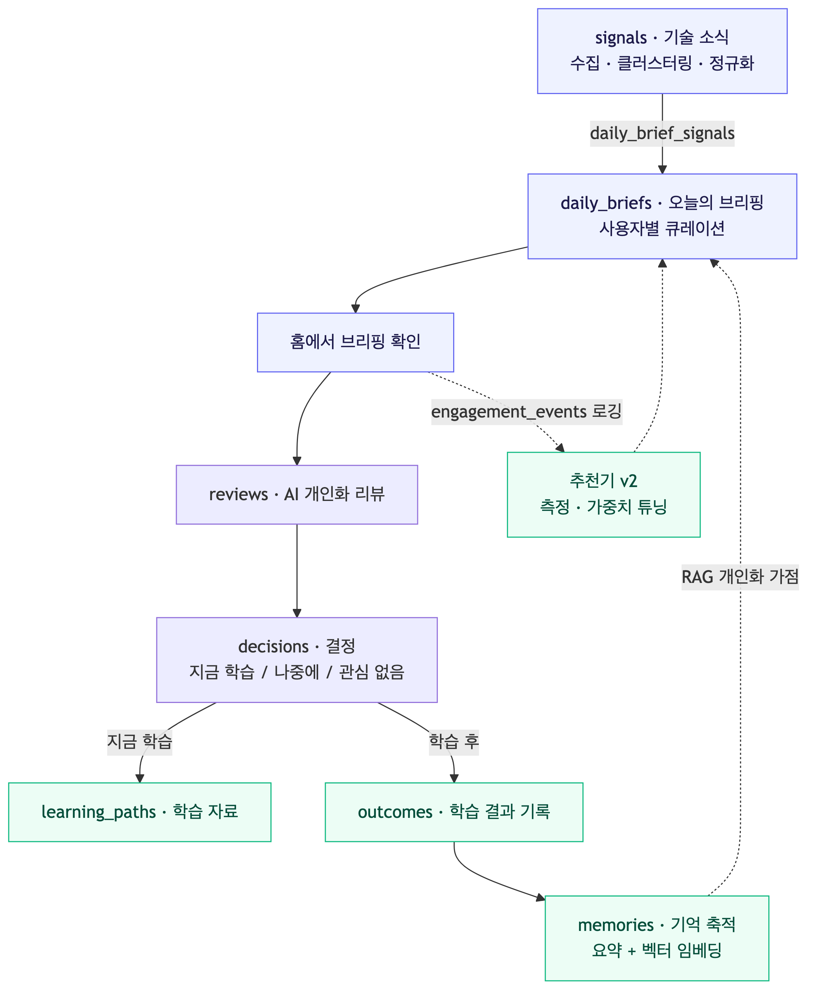
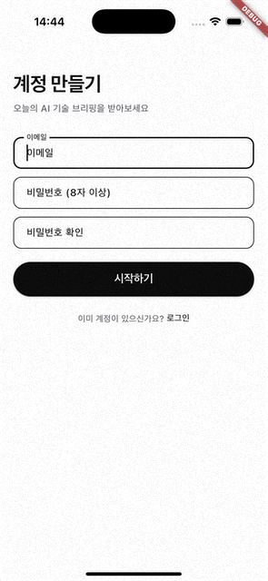
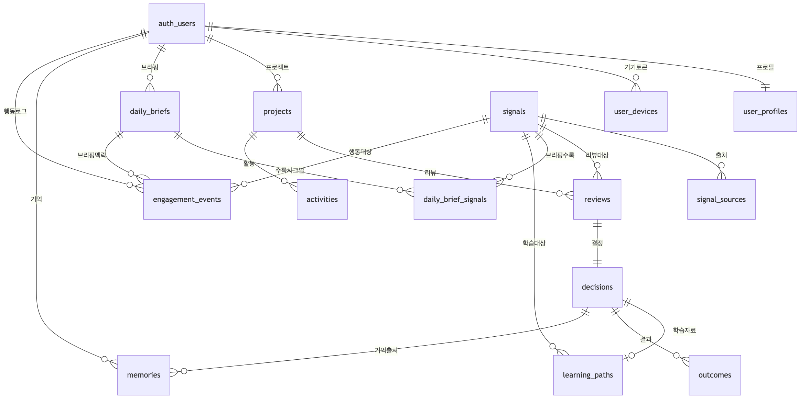

# Decision OS

> 정보를 보여주는 제품이 아니라, **사용자가 더 나은 결정을 내리도록 돕는 의사결정 운영체제(OS)**.

오늘날 문제는 정보의 부족이 아니다 — 검색·AI·뉴스레터로 정보는 넘친다. 진짜 어려운 건 **무엇을 믿고, 무엇을 무시하며, 무엇을 지금 행동으로 옮길지 결정하는 것**이다. Decision OS는 이 결정의 순간을 지원한다.

모든 기능은 하나의 **불변 루프**를 따른다:

```
Event(사건) → Review(AI 검토) → Decision(결정) → Outcome(결과) → Memory(기억)
```

기억(Memory)은 다음 사건의 검토·추천으로 되먹임되어, **쓸수록 나에게 맞춰진다.**

---

## Playbook 플랫폼

공통 결정 루프 위에 도메인별 **Playbook**을 얹는 구조다.

| Playbook | 다루는 결정 | 상태 |
|---|---|---|
| **AI Research** | 매일 쏟아지는 AI 기술 소식 중 *무엇을 배울지* | ✅ 구현 완료 |
| **Insurance** | 보험 이벤트에 대한 *어떻게 대응할지* | 📋 기획 단계 |
| Career · Investment · … | 확장 가능 | 아이디어 |

---

## 핵심 사용자 흐름 (AI Research)



기술 소식을 수집·큐레이션해 **오늘의 브리핑**으로 보여주고 → 각 소식에 **AI 개인화 리뷰**를 붙이고 → 사용자가 *지금 학습 / 나중에 / 관심 없음*을 **결정**하고 → 학습 후 **결과**를 남기면 → 그것을 **기억**으로 축적해 다음 브리핑을 개선한다.

---

## 기술 스택

| 영역 | 스택 |
|---|---|
| **웹** | Next.js 16 (App Router) · React 19 · TypeScript · Tailwind 4 · Supabase SSR |
| **백엔드** | FastAPI (Python) · OpenAI · 배치/에이전트 파이프라인 |
| **모바일** | Flutter · Riverpod · go_router · FCM(푸시) |
| **DB / 인증** | Supabase Postgres + pgvector(임베딩) · Supabase Auth |

**아키텍처 원칙** — 읽기는 Supabase SDK 직접(anon key + JWT + RLS), 쓰기는 반드시 FastAPI 경유(service_role). FastAPI는 단일 앱이고 Playbook은 내부 라우터/모듈이다.

## 저장소 구조

```
decision-os/
├── web/          # Next.js 웹 앱 (App Router, TypeScript)
├── api/          # FastAPI 백엔드 (수집·리뷰·추천·메모리 파이프라인)
├── mobile/       # Flutter iOS/Android 앱
├── docs/         # 문서 (구현 현황·DB·동작 원리·다이어그램)
└── _bmad-output/ # 기획 산출물 (개발 대상 아님)
```

## 로컬 실행

환경변수는 각 패키지의 예시 파일(`.env.example` / `.env.local.example`)을 복사해 채운다.

```bash
# 백엔드 (api/)
cd api && python3 -m venv .venv && source .venv/bin/activate
pip install -r requirements.txt
cp .env.example .env
uvicorn main:app --reload --port 8000       # 헬스체크: GET /api/v1/health

# 웹 (web/)
cd web && npm install
cp .env.local.example .env.local
npm run dev                                  # http://localhost:3000

# 모바일 (mobile/)
cd mobile && flutter pub get && flutter run
```

### 환경변수

| 변수 | 위치 | 설명 |
|------|------|------|
| `SUPABASE_URL` | `api/.env` | Supabase 프로젝트 URL |
| `SUPABASE_SERVICE_ROLE_KEY` | `api/.env` | Supabase service_role 키 (서버 전용) |
| `NEXT_PUBLIC_SUPABASE_URL` | `web/.env.local` | Supabase 프로젝트 URL |
| `NEXT_PUBLIC_SUPABASE_ANON_KEY` | `web/.env.local` | Supabase anon 키 |
| `FASTAPI_BASE_URL` | `web/.env.local` | FastAPI 백엔드 URL |

> 실제 키·URL 값은 저장소에 커밋하지 않는다 — 배포 플랫폼의 시크릿/환경변수로만 주입한다.

---

## 프로젝트 자세히 보기

> 각 항목을 펼치면 핵심 내용을 볼 수 있고, 맨 아래 링크로 전체 문서로 이동한다.

<details>
<summary><b>🎬 시연 · 유저 시나리오</b></summary>

<p align="center">
  
</p>

**"오늘 뭘 배우지?"를 대신 정리해 주는 하루**

1. **가입 & 온보딩** — 역할·기술 스택·목표·관심사·하루 학습 시간을 입력한다.
2. **오늘의 브리핑** — 홈에 나에게 맞춰 큐레이션된 AI 기술 소식 카드가 뜬다.
3. **AI 리뷰 열람** — 카드를 누르면 "왜 나에게 쓸모 있는지" 개인화 리뷰를 본다.
4. **결정** — *지금 학습 / 나중에 / 관심 없음* 중 하나를 고른다.
5. **학습 & 결과** — "지금 학습"이면 학습 자료 5개를 받고, 학습 후 결과(적용함/도움됨 등)를 기록한다.
6. **점점 똑똑해짐** — 결정·결과가 기억으로 쌓여 다음 브리핑이 더 정확해진다.

> 곁가지: **보관함**(나중에 학습 모음) · **히스토리**(결정 → 결과 타임라인).

<!-- 화면별 스크린샷 — 파일을 docs/media/ 에 넣고 아래 주석을 해제:
| 홈 브리핑 | AI 리뷰 | 결정 | 히스토리 |
|---|---|---|---|
|  |  |  |  |
-->

</details>

<details>
<summary><b>📊 구현 현황 (에픽별)</b></summary>

AI Research Playbook은 Epic 1~6이 dev + 코드리뷰까지 **전부 완료(done)** 됐고 현재 라이브다.

| Epic | 주제 | 핵심 기능 |
|---|---|---|
| 1 | 플랫폼 기반 · 사용자 정체성 | 인증(로그인/가입), 내비게이션 셸, 온보딩, 프로필 (웹·모바일) |
| 2 | 데일리 브리핑 · AI 파이프라인 | 시그널 수집·정규화, 리뷰어 에이전트, 추천기+브리핑 배치, 온디맨드 트리거 |
| 3 | 리서치 리뷰 · 결정 | 리뷰 상세, 온디맨드 리뷰, 결정(지금학습/나중에/관심없음), 맥락 채팅 |
| 4 | 러닝 패스 · 결과 | 학습 자료 생성, 결과(Outcome) 기록, 메모리 매니저 |
| 5 | 큐 · 히스토리 · 개인화 | 보관함, 히스토리 타임라인, 푸시 알림, 메모리 개인화·접근성 |
| 6 | 실데이터 수집 · 품질 v2 | 실 수집기+레지스트리, 의미 클러스터링·세이프티 필터, normalize v2, 추천기 v2, 측정 하네스 |

**남은 일**: Insurance Playbook(기획만), 에픽 회고(미실시), Flutter 앱 배포(수동).

→ 전체: [`docs/IMPLEMENTATION-STATUS.md`](docs/IMPLEMENTATION-STATUS.md)

</details>

<details>
<summary><b>⚙️ 동작 원리 (파이프라인)</b></summary>

**실행 모드 2가지** — ① 매일 06:00 KST **배치**(수집→브리핑), ② 사용자 액션 시 **백그라운드**(리뷰·학습자료·메모리).

**배치 5단계**
1. **수집** — RSS·GitHub·HackerNews 어댑터를 격리 호출 후 중복 제거
2. **클러스터링·필터** — 임베딩으로 유사 기사 묶고, 세이프티·관련성 필터
3. **정규화** — 토픽 단위로 `signals` + `signal_sources` 저장
4. **시그널 빌드** — LLM이 제목·요약 생성 (토픽 수에 비례)
5. **리뷰 → 추천 → 브리핑** — 사용자별 개인화 리뷰 + 점수화 후 브리핑 저장

**추천 점수** = 프로필·시그널 임베딩 관련도 + **메모리 RAG 가점** + 최신성·인기·권위 + 다양성(MMR).

**되먹임 루프** — 결과(Outcome) 기록 → 메모리(요약+벡터) 축적 → `match_memories`(RAG)로 다음 브리핑 개인화.

공통 패턴: 비동기 상태머신(`pending→processing→completed/failed`), 안전 저하(한 단계 실패해도 폴백), LLM 교체 가능 추상화.

→ 전체: [`docs/HOW-IT-WORKS.md`](docs/HOW-IT-WORKS.md)

</details>

<details>
<summary><b>🗄 데이터 모델 (14개 테이블 · ERD)</b></summary>

Postgres 14개 테이블, 전부 Row-Level Security 활성. 뿌리는 사용자(`auth.users`)와 콘텐츠(`signals`) 둘.



**결정 루프 축**: `signals → reviews → decisions → outcomes → memories`
**브리핑 축**: `signals → daily_brief_signals → daily_briefs`

| 그룹 | 테이블 |
|---|---|
| 신원·계정 | `user_profiles` · `user_devices` |
| 공통 Decision Loop | `projects` · `reviews` · `decisions` · `outcomes` · `memories` · `activities` |
| AI Research 전용 | `signals` · `signal_sources` · `daily_briefs` · `daily_brief_signals` · `learning_paths` · `engagement_events` |

→ 컬럼 상세: [`docs/DB-COLUMNS.md`](docs/DB-COLUMNS.md)

</details>

<details>
<summary><b>🖥 화면 ↔ 테이블 매핑</b></summary>

| 화면 | 읽는 것 |
|---|---|
| **홈** | 오늘 브리핑에 큐레이션된 `signals` (`daily_briefs`→`daily_brief_signals`) |
| **보관함** | "나중에 학습" 한 `decisions` (choice=queue) |
| **히스토리** | 내 `decisions` + `outcomes` (※ "메모리 타임라인"은 UI 명칭, `memories` 테이블 아님) |
| **리뷰 상세** | 개인화 AI `reviews` 결과 |
| **학습 자료** | learn_now 결정으로 생성된 `learning_paths` |

`memories`는 **노출 화면 없음** — 추천 개인화(RAG)용 내부 데이터.

</details>

---

## 문서

- [`docs/IMPLEMENTATION-STATUS.md`](docs/IMPLEMENTATION-STATUS.md) — 구현 현황 · DB 구조 · 화면↔테이블 매핑
- [`docs/HOW-IT-WORKS.md`](docs/HOW-IT-WORKS.md) — 파이프라인 동작 원리
- [`docs/DB-COLUMNS.md`](docs/DB-COLUMNS.md) — 테이블별 컬럼 레퍼런스
