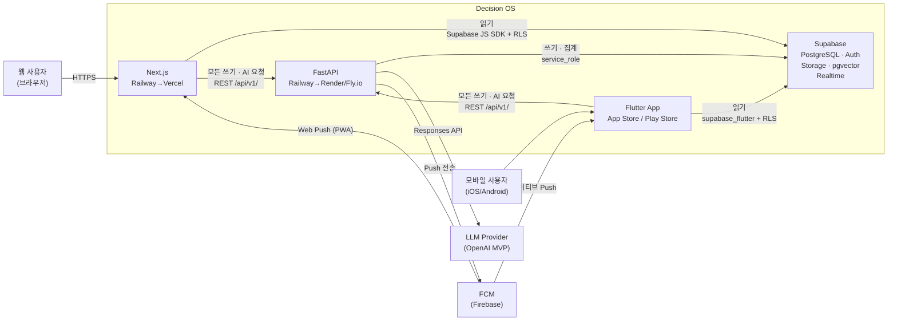
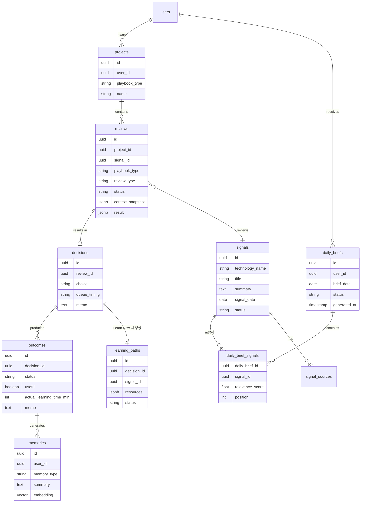
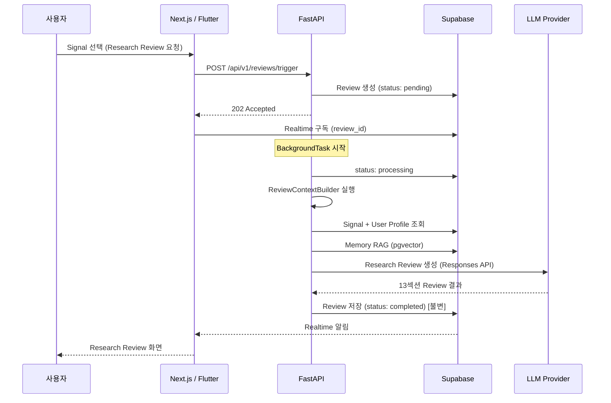
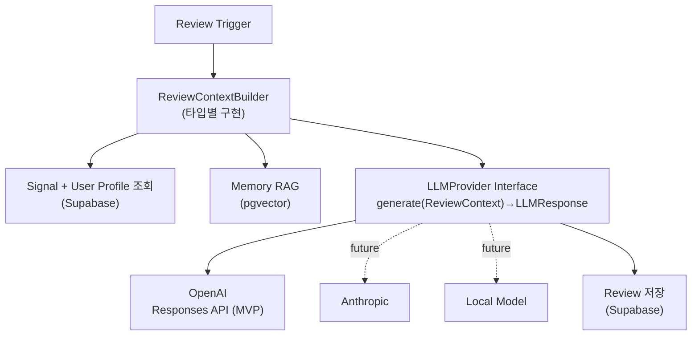
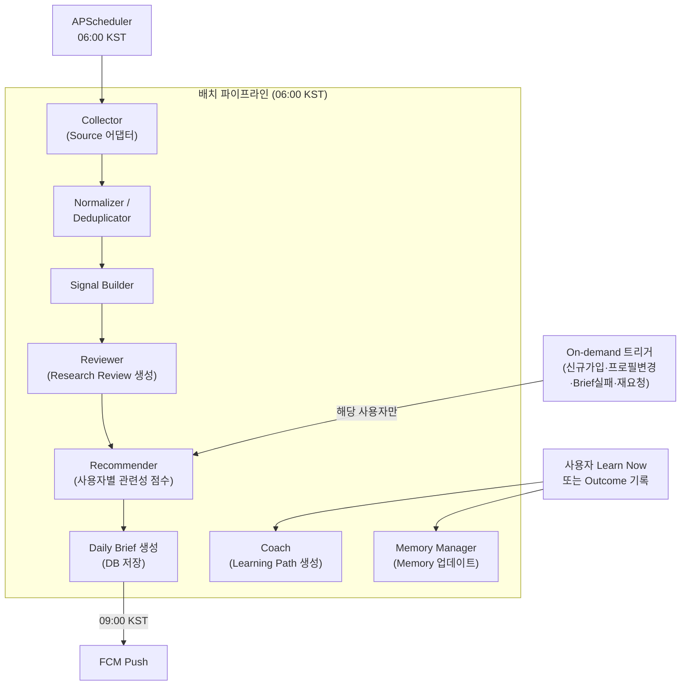

## Paradigm

**Layered Playbook Platform** — 공통 Decision Loop 인프라 위에 Playbook 모듈을 수직으로 쌓는 구조. 단일 FastAPI 앱과 단일 Next.js 앱으로 구성된 모듈형 모놀리스이며, Playbook은 독립 서비스가 아니라 FastAPI 내부 모듈이다. AI Research가 첫 번째 Playbook이며, 배치 기반 Agent Workflow 파이프라인이 Daily Brief를 사전 생성한다. 읽기와 쓰기의 데이터 접근 경로를 분리해 FastAPI는 AI 연산과 비즈니스 규칙에만 집중한다.

---

## Architecture Decisions

### AD-1 — 모듈형 모놀리스
**Binds:** FastAPI 단일 앱; Playbook은 내부 라우터/모듈로 구성  
**Prevents:** Playbook별 독립 마이크로서비스, 도메인 간 직접 서비스 호출  
**Rule:** 새 Playbook 추가 = FastAPI 내부에 모듈 추가; 별도 서비스 배포 불허

---

### AD-2 — 스택 [ADOPTED]
**Binds:** Next.js (Railway MVP → Vercel 이전) · Flutter (iOS/Android, App Store + Google Play) · FastAPI (Railway MVP → Render/Fly.io 이전) · Supabase (PostgreSQL + Auth + Storage + pgvector + Realtime) · FCM (Firebase Cloud Messaging)  
**Prevents:** 외부 벡터 DB, 별도 인증 서버, 추가 데이터 인프라, 플랫폼별 별도 백엔드, FCM 외 Push 서비스  
**Rule:** 벡터 검색(RAG)은 Supabase 내 pgvector(HNSW 인덱스)로만 운영. Railway는 MVP 전용 — 프로덕션 스케일 시 Next.js는 Vercel, FastAPI는 Render 또는 Fly.io로 이전. Flutter와 Next.js는 동일한 FastAPI 백엔드 공유. **FCM이 유일한 Push Notification 서비스** — Flutter 네이티브 FCM SDK, Next.js PWA FCM Web SDK; FastAPI가 단일 FCM 전송 지점; 클라이언트는 로그인/앱 오픈 시 FCM 토큰을 FastAPI에 등록

---

### AD-3 — 데이터 접근 소유권
**Binds:** 읽기 → Next.js(Supabase JS SDK) 및 Flutter(supabase_flutter SDK) 모두 Supabase 직접 조회 (RLS + anon key + JWT); 쓰기 → 클라이언트 플랫폼(웹/모바일) 무관하게 모든 core 테이블 쓰기는 FastAPI 경유 (service_role key)  
**Prevents:** 클라이언트의 직접 쓰기(플랫폼·이유 불문), service_role key 클라이언트 노출, 권한 판단 로직의 클라이언트 유출  
**Rule:** 모든 사용자 데이터 테이블에 RLS 필수; `reviews` · `decisions` · `outcomes` · `activities` · `memories` · `learning_paths` 테이블의 모든 INSERT/UPDATE/DELETE는 FastAPI만 수행; 집계·크로스-테이블 조인·권한 판단이 필요한 읽기는 FastAPI 경유; Flutter와 Next.js는 동일한 데이터 접근 패턴 적용

---

### AD-4 — Playbook 데이터 모델
**Binds:** `projects.playbook_type`이 도메인 분기의 단일 진입점; 공통 테이블(`projects` `reviews` `decisions` `outcomes` `memories`)은 Playbook 무관; Playbook 테이블은 `project_id` FK로 공통 레이어에 연결; `reviews.context_snapshot`·`reviews.result` JSONB 봉투 형식 고정; `signals`는 플랫폼 레벨(사용자 무관), `daily_briefs`·`learning_paths`는 사용자 레벨  
**Prevents:** Playbook 특유 필드의 공통 테이블 오염, 봉투 없는 자유 형식 JSONB, Signal을 기사 단위로 저장, 사용자별 Signal 중복 저장  
**Rule:** 새 Playbook = 새 Playbook 테이블 세트 + `project_id` FK + 해당 Playbook의 `ReviewContextBuilder`; `context_snapshot`·`result` JSONB는 반드시 `{"schema_version": int, "review_type": str, "payload": {...}}` 최상위 봉투 유지; `outcomes.status` → `completed | applied | dropped | not_useful`

---

### AD-5 — 비동기 AI 작업 실행
**Binds:** 모든 사용자 트리거 AI 생성 작업(Research Review, Learning Path)은 비동기; 트리거 → 202 즉시 응답 → BackgroundTask → 상태 업데이트; 프론트는 Supabase Realtime 또는 폴링으로 완료 감지; `completed`·`failed` 상태는 불변  
**Prevents:** LLM 호출을 HTTP 응답에 동기화, 업로드 데이터와 AI 처리를 같은 트랜잭션에 묶기, 종료 상태 진입 후 추가 쓰기  
**Rule:** 데이터 저장은 AI 처리 전 완료·커밋; 상태 머신: `pending → processing → completed | failed`; `completed`·`failed` 진입 후 상태·result 추가 변경 금지; `failed` 시 소스 데이터 보존 + UI 알림 + 자동 재시도 없음(사용자 재트리거); 이 패턴은 Research Review와 Learning Path 생성 모두에 적용

---

### AD-6 — AI Review 엔진 패턴
**Binds:** `ReviewContextBuilder`가 Review 타입별 필요한 최소 컨텍스트만 조립; `LLMProvider` 인터페이스로 공급자 추상화; RAG는 pgvector(Supabase)가 담당; Interface 메서드 시그니처 고정  
**Prevents:** LLM 직접 호출이 비즈니스 로직에 산재, Playbook 로직과 LLM 공급자 결합, DB 전체를 LLM 컨텍스트에 주입, 공급자별 상이한 반환 타입  
**Rule:** `LLMProvider` 인터페이스: `generate(context: ReviewContext) → LLMResponse`; 에러는 `LLMProviderError`; MVP 구현체는 OpenAI Responses API 사용(Chat Completions 불허); Provider 교체는 구현체 교체만으로 수행; 새 Review 타입 = 새 `ReviewContextBuilder` 구현; RAG는 외부 벡터 DB 불허

---

### AD-7 — Memory [ADOPTED]
**Binds:** MVP부터 `memories` 테이블 포함; Decision Loop 완결점은 Signal→Review→Decision→Outcome→**Memory**; Memory는 Outcome 기록 후 FastAPI가 AI로 추출·저장  
**Prevents:** Memory를 단순 로그로 취급, 원본 이력(reviews/decisions/outcomes)의 Memory 중복 저장, Memory를 프론트에서 직접 쓰기  
**Rule:** `memories` 쓰기는 FastAPI만(AD-3); `memory_type`: `preference` | `skill` | `project` | `decision_history` | `outcome_history`; `summary` 임베딩(VECTOR 1536) 저장 — Daily Brief 개인화·Recommender Agent 컨텍스트에 활용

---

### AD-8 — MVP AI Research Playbook 범위
**Binds:** 사용자당 AI Research Project 1개 자동 생성("내 AI 학습"); Decision CTA 3종: `Learn Now` / `Queue` / `Ignore`; Queue 타이밍 3종: `Today` / `This Week` / `Later`; Outcome 4종: `Completed` / `Applied` / `Dropped` / `Not Useful`; 첫 Review 타입: Signal → Research Review(13섹션)  
**Prevents:** MVP 내 Insurance/Career/Investment Playbook, 완전 자율 Agent(Human-in-the-loop 없는 자동 결정), 기사 단위 Signal  
**Rule:** Signal은 하나의 기술/변화에 대한 다출처(Official Blog·GitHub·Reddit·HN·YouTube) 묶음; Research Review는 13섹션 필수 구조; `Learn Now` 선택 시에만 Learning Path 생성; 단일 Review 타입 완성·안정화 후 순차 확장

---

### AD-9 — RLS 구현 패턴
**Binds:** 모든 Playbook 테이블의 RLS 정책 작성 방식  
**Prevents:** 테이블 내 `user_id` 직접 컬럼 방식의 RLS(보안 의미 불일치 위험), 팀별 상이한 Join 패턴  
**Rule:** Playbook 테이블 RLS는 반드시 `project_id → projects.user_id` 서브쿼리 방식으로 작성: `EXISTS (SELECT 1 FROM projects WHERE id = project_id AND user_id = auth.uid())`; `daily_briefs`·`memories`·`learning_paths` 등 user_id 직접 컬럼 보유 테이블은 `user_id = auth.uid()` 단순 정책 허용; 테이블에 `user_id` 직접 비정규화 후 RLS 방식 금지(project 경유 테이블 한정)

---

### AD-10 — 보안 포지션
**Binds:** 파일 업로드 검증, 프롬프트 격리, 시크릿 관리, 개인정보 수집 원칙  
**Prevents:** 악성 파일 업로드, 사용자 데이터가 시스템 프롬프트에 주입, 시크릿의 코드·프론트 노출, PIPA 위반  
**Rule:** 파일 업로드는 FastAPI에서 허용 MIME 타입·크기 상한 검증 후 Supabase Storage 이동; LLM 호출 시 시스템 프롬프트(역할·규칙)와 사용자 데이터 컨텍스트를 분리 전달; Railway 환경변수로 시크릿 관리(코드·리포지토리 미포함); 개인정보는 기능에 필요한 최소 수집(PIPA 최소 수집 원칙)

---

### AD-11 — 테스트 전략
**Binds:** 계층별 테스트 방식  
**Prevents:** 팀별 상이한 테스트 패턴으로 인한 CI 구성 충돌, LLM 호출이 포함된 테스트의 비결정성·비용 낭비  
**Rule:** 비즈니스 로직·`ReviewContextBuilder`·Agent 파이프라인 단계 → FastAPI 단위 테스트(실제 Supabase 테스트 DB 연결, 프로덕션 DB 모킹 금지); LLM Provider → `LLMProvider` 인터페이스 모킹; 비동기 Review/Learning Path 상태 전이 → BackgroundTask 통합 테스트; Next.js → 컴포넌트 단위 테스트; 배치 파이프라인 → Agent별 단위 테스트(Collector 어댑터 모킹)

---

### AD-12 — 관찰 가능성
**Binds:** 로그 형식, stuck 감지, 에러 추적  
**Prevents:** review_id 없는 로그로 인한 비동기 디버깅 불가, `processing` 상태 무한 고착  
**Rule:** 모든 FastAPI 로그는 JSON 구조화 형식, `review_id`·`playbook_type` 필드 포함; 배치 파이프라인 로그는 `brief_date`·`pipeline_stage`·`user_count` 포함; `processing` 상태 타임아웃 임계값을 설정값으로 고정(초과 시 `failed`로 전이); 모든 FastAPI 예외는 `review_id` 포함 로그 필수; 외부 알림 경로(Slack 등)는 Deferred

---

### AD-13 — 클라이언트 ↔ FastAPI API 계약 (Next.js · Flutter 공통)
**Binds:** 인증 방식, 기본 경로, 응답 봉투 — 웹·모바일 클라이언트 공통 적용  
**Prevents:** 플랫폼별 상이한 인증 헤더, 일관성 없는 에러 응답 형식, 플랫폼별 별도 API 엔드포인트  
**Rule:** 인증: `Authorization: Bearer {Supabase JWT}`; 기본 경로: `/api/v1/`; 응답 봉투: `{"data": ..., "error": null | {"code": str, "message": str}}`; FastAPI의 OpenAPI 스키마 자동 생성(`/docs`) 유지; 웹/모바일 분기 엔드포인트 금지

---

### AD-14 — Flutter 상태관리
**Binds:** Flutter 앱 전체의 상태관리 라이브러리  
**Prevents:** Bloc·Provider·GetX 등 혼용으로 인한 상태 소유권 충돌, Riverpod과 다른 패턴의 비동기 처리  
**Rule:** Riverpod 2.x 단일 표준; `@riverpod` 코드 생성 방식 사용; 비동기 Review/Learning Path 상태는 `StreamProvider`로 Supabase Realtime 구독; 다른 상태관리 라이브러리 도입 금지

---

### AD-15 — Agent Workflow 실행 모델
**Binds:** Daily Brief 생성 파이프라인의 실행 방식 — Batch First + On-demand Fallback  
**Prevents:** 사용자 앱 오픈 시마다 전체 파이프라인 실행, Signal 수집과 개인화 추천을 단일 단계로 결합, 배치 실패 시 전체 사용자 Brief 미제공  
**Rule:** 기본 실행은 배치(APScheduler, 06:00 KST): Collector→Normalizer→Signal Builder→Reviewer→Recommender→Daily Brief DB 저장 순차 실행, 완료 후 09:00 KST FCM Push; On-demand는 Recommender 이후 단계만 실행(Signals는 이미 생성됨) — 신규 가입·프로필 변경·Brief 실패·사용자 재요청 시에만 허용; On-demand 트리거는 AD-5 비동기 패턴 적용(202→BackgroundTask)

---

### AD-16 — 외부 콘텐츠 수집 패턴
**Binds:** Collector 레이어의 추상화 방식; Signal의 정규화 단위  
**Prevents:** Source별 파싱 로직이 Signal Builder에 혼재, 기사 단위 Signal 저장, Source 추가 시 하위 파이프라인 수정  
**Rule:** Collector는 Source 어댑터 인터페이스로 추상화 — 각 어댑터는 `collect() → list[RawArticle]` 출력; Normalizer/Deduplicator가 RawArticle → Signal(기술 단위) 변환을 전담; 하나의 Signal = 하나의 기술/변화 + 다출처(Official Blog·GitHub·Reddit·HN·YouTube) 묶음; 새 Source 추가 = 새 어댑터 구현, 하위 파이프라인 무수정; 특정 API 방식(REST vs 스크래핑)은 어댑터 내부 구현 사항 — 스파인에 고정하지 않음

---

### AD-17 — Push Notification 전달
**Binds:** Push Notification 서비스 선택 및 FastAPI→클라이언트 전달 경로  
**Prevents:** 플랫폼별 별도 Push 서비스(APNs 직접, Web Push 별도), 클라이언트가 Push를 직접 발송, FCM 토큰의 클라이언트 사이드 전송  
**Rule:** FCM(Firebase Cloud Messaging)이 유일한 Push 서비스 — Flutter 네이티브 SDK, Next.js PWA FCM Web SDK; FastAPI가 FCM REST API로 단일 전송; 클라이언트는 로그인·앱 오픈 시 FCM 토큰을 `/api/v1/devices/register`에 등록 (FastAPI `user_devices` 테이블 저장); Push 트리거 3종: Daily Brief 준비(09:00), Queue Today 리마인더(20:00), Outcome 입력 요청(Learn Now 후 3일); FCM 토큰 만료·갱신은 클라이언트가 감지 후 재등록

---

## Deferred

지금 결정하지 않는 것들 — 아래 조건이 충족될 때 재검토:

| 항목 | 재검토 조건 |
|------|------------|
| **Source별 수집 API 방식 (REST API vs 스크래핑)** | **Collector 어댑터 구현 착수 직전** |
| **OpenAI 모델 티어 (GPT-4o vs o-series 등)** | **구현 착수 직전 비용·성능 기준으로 결정** |
| 배포 환경 토폴로지 (dev/staging/prod 분리) | 팀 규모 확장 또는 첫 스테이징 환경 필요 시 |
| 메시지 브로커 (ARQ / async Redis Queue) | BackgroundTasks 처리 용량 한계 도달 시 |
| Realtime 페이로드 계약 (REPLICA IDENTITY, 이벤트 필드) | API 계약 정의 시 함께 결정 |
| Playbook 테이블 명명·타입 컨벤션 | 두 번째 Playbook 착수 직전 |
| 외부 알림 경로 (Slack 등 failed 알림) | MVP Realtime/폴링 이후 사용자 요구 발생 시 |
| Memory 테이블 스키마 상세 | 실운용 후 장기 맥락 재사용 패턴 확인 시 |
| Insurance / Career / Investment / Real Estate Playbook | AI Research MVP 안정화 이후 |
| Anthropic / Local LLM Provider 구현 | LLMProvider Interface 완성 후 교체 시 |
| 생애주기 정보 수집 범위 (온보딩 이후 심화) | UX 설계 2차 시 |
| Flutter 앱 배포 파이프라인 (CI/CD, Fastlane 등) | 첫 TestFlight/내부 테스트 배포 전 |
| Flutter 최소 지원 OS 버전 (iOS/Android) | 개발 착수 직전 |
| Flutter 전용 UX 화면 인벤토리·네비게이션 패턴 | Flutter UX 설계 착수 직전 (현재 EXPERIENCE.md는 웹 전용) |
| Contextual Chat 세션 영속성 (V2) | V1 출시 후 사용자 요구 확인 시 |
| 배치 파이프라인 실패 시 부분 재실행 전략 | 배치 운영 중 실패 패턴 확인 후 |
| Signal 아카이빙 정책 (보관 기간, 정리 주기) | 데이터 규모 확인 후 |
| V2 + 버튼 (사용자 제출 분석 후보: GitHub·URL·YouTube·RSS) | AI Research MVP 안정화 이후 |
