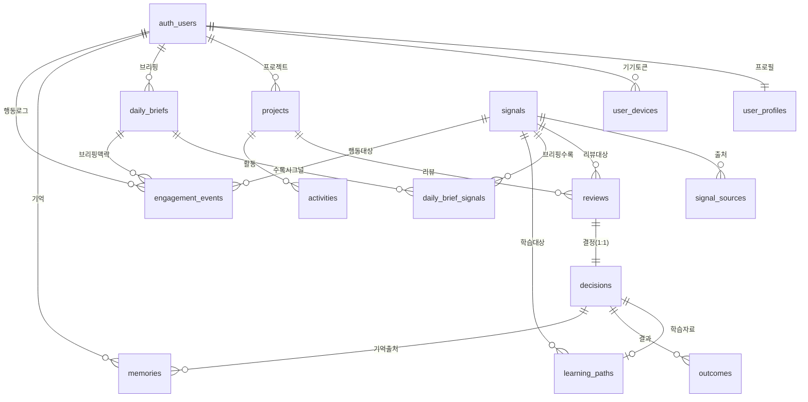

# Decision OS — 구현 현황 (Implementation Status)

> 이 문서는 "지금까지 무엇을 만들었나"를 한눈에 보는 요약본이다.
> 상세 근거는 `_bmad-output/implementation-artifacts/`(스토리별 기록)와
> `sprint-status.yaml`(완료 체크리스트)에 있다.
>
> 최종 갱신: 2026-07-31

---

## 0. Decision OS 소개

**Decision OS는 정보를 보여주는 제품이 아니라, 사용자가 더 나은 결정을 내리도록 돕는 "의사결정 운영체제(OS)"다.**

오늘날 문제는 정보의 부족이 아니다 — 검색·AI·뉴스레터로 정보는 넘친다. 진짜 어려운 건 **무엇을 믿고, 무엇을 무시하며, 무엇을 지금 행동으로 옮길지 결정하는 것**이다. Decision OS는 이 결정의 순간을 지원한다.

그래서 모든 기능은 하나의 **불변 루프**를 따른다:

```
Event(사건) → Review(AI 검토) → Decision(결정) → Outcome(결과) → Memory(기억)
```

이 루프는 도메인이 바뀌어도 변하지 않으며, 그대로 데이터 구조에 대응된다 — `signals`(Event) → `reviews` → `decisions` → `outcomes` → `memories`. 기억은 다음 사건의 검토·추천을 개인화하는 데 되먹임되어, 쓸수록 나에게 맞춰진다.

- **플랫폼 = Playbook 위에 쌓는 구조**: 공통 결정 루프 위에 도메인별 "Playbook"을 얹는다. **AI Research**가 첫 번째 Playbook(현재 라이브)이고, **Insurance**·Career·Investment 등으로 확장 가능하도록 설계됐다.
- **AI Research Playbook**은 이 루프를 "매일 쏟아지는 AI 기술 소식 중 무엇을 배울지"라는 결정 문제에 적용한 것이다.

---

## 1. 한눈 요약

**Decision OS = "AI 기술 소식을 매일 골라주고 → 학습 여부를 결정하고 → 실제로 배웠는지 결과를 남겨, 다음 추천이 점점 나에게 맞춰지는" 개인 학습 의사결정 앱.**

일상 비유: **개인 비서가 매일 아침 "이 AI 기술 소식 3개가 당신 프로젝트에 쓸모 있어 보여요"라고 브리핑 → 내가 "지금 배울게 / 나중에 / 관심 없음"을 결정 → 배운 뒤 "실제로 도움 됐다/안 됐다"를 적어두면 → 비서가 그걸 기억해 다음 브리핑을 더 잘 골라줌.**

- **플레이북(제품 라인) 2종**
  - **AI Research Playbook** — ✅ Epic 1~6 전부 구현 완료 (현재 라이브)
  - **Insurance Playbook** — 📋 기획(에픽/스토리)만 존재, 미구현 (backlog)
- **클라이언트 2종**: 웹(Next.js) + 모바일(Flutter). 백엔드/DB는 공용.

---

## 2. 기술 스택

| 영역 | 스택 | 배포 |
|---|---|---|
| **웹** (`web/`) | Next.js 16 (App Router) · React 19 · TypeScript · Tailwind 4 · Supabase SSR | Railway (main push 시 자동배포) |
| **백엔드** (`api/`) | FastAPI (Python) · OpenAI · 배치/에이전트 파이프라인 · Supabase | Railway (main push 시 자동배포) |
| **모바일** (`mobile/`) | Flutter · Riverpod · go_router · supabase_flutter · FCM(푸시) | ⏳ 수동 빌드 (자동배포 없음) |
| **DB/인증** | Supabase Postgres + **pgvector**(임베딩) · Supabase Auth | Supabase 관리형 |

- 라이브 URL: 웹 `https://web-production-3ece1.up.railway.app` / 백엔드 `https://decision-os-production.up.railway.app`
- 상세 배포 방법: [`docs/deployment.md`](./deployment.md), [`../README.md`](../README.md)

---

## 3. 에픽별 구현 현황 (AI Research Playbook)

모든 스토리가 dev + 코드리뷰까지 완료(done). 아래는 "무엇이 되는가" 관점 요약.

| Epic | 주제 | 구현된 것 (핵심 기능) | 상태 |
|---|---|---|---|
| **1** | 플랫폼 기반 · 사용자 정체성 | 프로젝트 스캐폴딩 + DB 기반, 이메일 인증(로그인/가입), 웹·Flutter 내비게이션 셸, 온보딩 위저드(웹·모바일), 프로필 화면(웹·모바일) | ✅ done |
| **2** | 데일리 브리핑 · AI 시그널 파이프라인 | 시그널 수집·정규화 파이프라인, AI 시그널 빌더+리뷰어 에이전트, 추천기 + 데일리 브리핑 배치, 홈 브리핑 화면, 온디맨드 브리핑 트리거 | ✅ done |
| **3** | 리서치 리뷰 · 결정 | 리뷰 상세 화면, 온디맨드 리뷰 생성, ContextStickyBar + 결정(지금 학습/나중에/관심없음), 맥락 기반 채팅 | ✅ done |
| **4** | 러닝 패스 · 결과 | 러닝 패스(학습 자료) 생성·화면, 학습 결과(Outcome) 기록, 메모리 매니저(결정·결과를 기억으로 축적) | ✅ done |
| **5** | 큐 · 히스토리 · 개인화 | 보관함(큐) 탭, 히스토리 메모리 타임라인, 푸시 알림 시스템, 메모리 기반 개인화 + 접근성 마감 | ✅ done |
| **6** | 실데이터 수집 · 시그널 품질 v2 | 실 수집기 어댑터 + 소스 레지스트리, 의미 클러스터링 + 관련성/세이프티 필터, normalize v2 + 시그널 스키마 확장, 추천기 v2, 측정 하네스 + engagement 로깅 | ✅ done |

### 이번 세션(2026-07-30) 라이브 후속 개선
- 웹: 빈 화면/토스트 문구 직관화(Signal→기술 소식, Queue→나중에 학습/보관함 등), 하단 네비 아이콘 SVG 교체, 히스토리 상세 "미완료" 항목에 **결과 기록하기** CTA 추가
- 모바일: 프로필 화면에 **로그아웃** 추가

---

## 4. 핵심 사용자 흐름 (데이터가 흐르는 순서)


> 다이어그램 원본: [`decision-os-flow.mmd`](./decision-os-flow.mmd) (Mermaid). 점선은 되먹임 루프 — 기억(memories)이 RAG로 다음 브리핑을 개인화하고, 행동 로그(engagement_events)가 추천기 튜닝에 쓰인다.

1. **signals** — 외부에서 수집한 AI 기술 소식(원천 콘텐츠).
2. **daily_briefs** + **daily_brief_signals** — 사용자별로 오늘의 브리핑에 어떤 시그널을 어떤 순서/점수로 담았는지.
3. **reviews** — 특정 시그널에 대한 AI 리뷰(왜 당신에게 쓸모 있는지 분석).
4. **decisions** — 그 리뷰를 보고 내린 결정(지금 학습 / 나중에 / 관심 없음).
5. **learning_paths** — "지금 학습" 시 생성되는 학습 자료 묶음.
6. **outcomes** — 학습 후 실제 결과(적용함/도움됨/그만둠 등).
7. **memories** — 결정·결과를 요약해 벡터로 저장 → 다음 추천 개인화(RAG)에 사용.
8. **engagement_events** — 노출/열람/결정 등 행동 로그 → 추천 성능 측정·개선.

---

## 5. 데이터베이스 구조

Supabase Postgres, 총 **14개 테이블**(모두 RLS 활성화). 사용자 식별의 뿌리는 Supabase 내장 `auth.users`.

### 5.1 테이블 역할

| 테이블 | 역할 (한 줄) | 핵심 관계 |
|---|---|---|
| `user_profiles` | 사용자 프로필(역할·경험·기술스택·목표·관심사·하루 학습시간·온보딩 완료 여부) | `auth.users` 1:1 |
| `user_devices` | 푸시 알림용 기기 토큰(FCM), platform=web/ios/android | `auth.users` 1:N |
| `projects` | 사용자의 플레이북 프로젝트(현재 `ai_research`). 리뷰·활동의 소속 단위 | `auth.users` 1:N |
| `signals` | **콘텐츠 원천** — 수집된 AI 기술 소식(제목·요약·인기도·권위·클러스터키·상태 raw/processed/archived) | 여러 테이블의 뿌리 |
| `signal_sources` | 한 시그널의 출처 링크들(공식블로그·github·reddit·hn·youtube 등) | `signals` 1:N |
| `daily_briefs` | 사용자별 "오늘의 브리핑" 컨테이너(날짜·상태·생성시각) | `auth.users` 1:N |
| `daily_brief_signals` | 브리핑↔시그널 **연결 테이블**(관련도 점수·노출 순서). 복합 PK | `daily_briefs`×`signals` N:M |
| `reviews` | 시그널에 대한 **AI 리뷰**(context_snapshot/result JSONB, 상태머신 pending→processing→completed/failed) | `projects`·`signals` → |
| `decisions` | 리뷰에 대한 사용자 **결정**(learn_now/queue/ignore, queue_timing, 메모). 리뷰당 1개(review_id unique) | `reviews` 1:1 |
| `learning_paths` | "지금 학습" 결정 시 생성되는 **학습 자료**(resources JSONB, 상태머신) | `decisions`·`signals` → |
| `outcomes` | 학습 후 **결과 기록**(completed/applied/dropped/not_useful, 유용 여부, 실제 학습시간, 메모) | `decisions` 1:N(최신 1건 사용) |
| `memories` | 결정·결과의 요약을 **벡터 임베딩**으로 축적 → 개인화(RAG). memory_type 5종 | `auth.users`·`decisions` → |
| `activities` | 프로젝트 단위 활동 로그(payload JSONB) — 확장용 | `projects` 1:N |
| `engagement_events` | **행동 로깅**(impression/open/read_through/decision, variant rag/coldstart) → 추천 측정 | `auth.users`·`signals`·`daily_briefs` → |

### 5.2 관계도 (ERD)


<details>
<summary>Mermaid 소스 (편집용)</summary>



</details>

> 다이어그램 원본은 [`decision-os-erd.mmd`](./decision-os-erd.mmd), 렌더 이미지는 [`decision-os-erd.png`](./decision-os-erd.png).

### 5.3 관계 읽는 법 (요약)

- **뿌리는 둘**: 사용자(`auth.users`)와 콘텐츠(`signals`). 나머지는 대부분 이 둘에 매달린다.
- **개인화 파이프라인 한 줄기**: `signals → daily_brief_signals → daily_briefs`(무엇을 보여줄지) 와 `reviews → decisions → outcomes/learning_paths → memories`(무엇을 하고 어떻게 기억할지)가 만나 다음 추천을 개선한다.
- **1:1 지점**: `user_profiles`(사용자당 1), `decisions`(리뷰당 1, `review_id` unique). 학습자료(`learning_paths`)도 사실상 결정당 1개.
- **연결 테이블**: `daily_brief_signals`만 복합 PK(N:M). 나머지는 단일 UUID PK.
- **보안**: 모든 public 테이블 RLS 활성 → 사용자는 자기 데이터만 접근.

### 5.4 화면 ↔ 테이블 매핑

각 화면이 실제로 어떤 테이블을 읽는지. (프론트 작업 시 참고)

| 화면 | 최상위 조회 테이블 | 실제로 읽는 것 |
|---|---|---|
| **홈** | `daily_briefs` → `daily_brief_signals` → `signals` | 오늘 날짜 내 브리핑에 큐레이션된 **signals** (position 순) |
| **보관함(Queue)** | `decisions` (choice=`queue`) → reviews → signals(제목) | "나중에 학습" 한 **decisions** |
| **히스토리** | `decisions` → reviews → signals + `outcomes` | 내 모든 **decisions + outcomes**(결과) |
| **리뷰 상세** | `reviews` (+ signals, signal_sources) | 개인화된 AI **review** 결과(JSONB) |
| **학습 자료** | `learning_paths` | learn_now 결정으로 생성된 자료 5개 |

⚠️ **주의 2가지**:
- **히스토리는 `memories`가 아니다.** UI 명칭이 "메모리 타임라인"이지만 실제 데이터는 `decisions + outcomes` 체인이다.
- **`memories` 테이블은 노출 화면이 없다.** 순수 내부용 — 결과 기록 시 축적되어(요약+벡터), 다음 브리핑 추천 점수에 RAG(`match_memories`)로만 반영된다.

---

## 6. 미완 · 보류 · 다음 할 일

| 항목 | 상태 | 비고 |
|---|---|---|
| **Insurance Playbook** (Epic 1~4) | 📋 backlog | 에픽/스토리 기획만 존재, 구현 착수 전 |
| 에픽 회고(retrospective) | ⏳ optional, 미실시 | Epic 6까지 완료 → 회고 좋은 타이밍 |
| **Flutter 앱 배포** | ⏳ 미실시 | Firebase App Distribution(Android 전용) 스크립트만 준비. 웹처럼 자동배포 아님 |
| 세부 보류 목록 | 📄 문서화됨 | `_bmad-output/implementation-artifacts/deferred-work.md` |

---

## 7. 참고 문서 지도

- 완료 체크리스트: `_bmad-output/implementation-artifacts/sprint-status.yaml`
- 스토리별 상세 구현 기록: `_bmad-output/implementation-artifacts/1-1 … 6-5.md`
- 보류 작업: `_bmad-output/implementation-artifacts/deferred-work.md`
- 기획(WHAT): `_bmad-output/planning-artifacts/prds/…/prd.md`, `prfaq-decision-os.md`
- 설계(HOW): `_bmad-output/planning-artifacts/architecture/…/ARCHITECTURE-SPINE.md`, `overview.md`
- 구조·실행: 루트 `README.md` / 배포: `docs/deployment.md`
